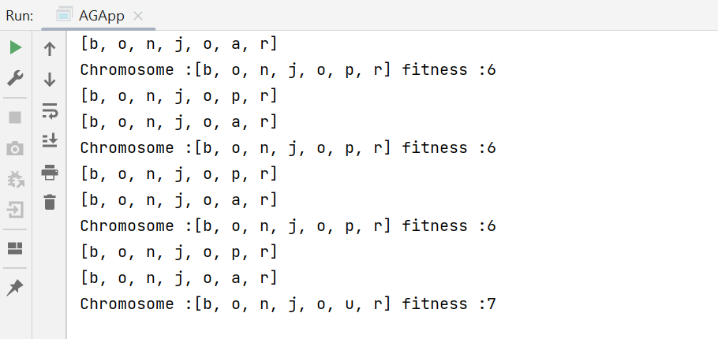

# Genetic algorithm
Genetic algorithms are search and optimization techniques inspired by evolutionary biology. They are often used to solve complex problems in which finding the exact solution using traditional methods is difficult.

Genetic algorithms start by creating a population of potential solutions, often called "individuals". Each individual is then evaluated based on a fitness function, which measures the quality of the solution it represents.

Next, the algorithm uses a combination of selection, reproduction, and mutation to create a new population of individuals that may be better suited to the problem at hand. This process is repeated for a number of generations until a satisfactory solution is found or a stopping criterion is met.

Genetic algorithms are used in a wide range of applications, including engineering design, financial modeling, and artificial intelligence. 

In this TP We will create an application to display 'BONJOUR' by using the genetique algourithme. 

## Sequential method
### Individual class 
This class defines an individual for a genetic algorithm, where each individual is represented by a set of 7 genes (stored in the "genes" array) and a fitness score (stored in "fitness"). The constructor of the class randomly initializes the genes of the individual with lowercase letters from the English alphabet. The "calculateFitness" method calculates the fitness score of the individual by comparing each gene with the corresponding letter in the word "bonjour" and adding 1 to the score for each match. The "compareTo" method implements the Comparable interface to allow comparison and sorting of individuals based on their fitness score.

```
import java.util.Random;

public class Individual implements Comparable{
    //Bonjour
    //chromosome
    private char genes[]=new char[7];
    private int fitness;

    public Individual() {
        Random rnd=new Random();
        for (int i=0;i<genes.length;i++){
            Random rand = new Random();
            char c = (char)(rand.nextInt(26) + 97);
            //System.out.println(c);
            genes[i]= c;
        }
    }
    public void calculateFitness(){
        fitness=0;
        char str[]={'b','o','n','j','o','u','r'};
        int  i=0;
        for (int gene:genes) {
                if(gene==str[i]){
                    fitness=fitness+1;
                }
                i++;
        }
    }

    public int getFitness() {
        return fitness;
    }

    public char[] getGenes() {
        return genes;
    }

    @Override
    public int compareTo(Object o) {
        Individual individual=(Individual) o;
        if (this.fitness>individual.fitness)
            return 1;
        else if(this.fitness<individual.fitness){
            return -1;
        }else
            return 0;
    }
}
```
### Population class 
This class represents a population of individuals in a genetic algorithm. It contains a list of individuals, and provides methods to initialize, calculate the fitness, select individuals based on their fitness, perform crossover and mutation operations, and sort the individuals based on their fitness. The selection method chooses the two fittest individuals from the population. The crossover method performs a crossover operation between the two selected individuals to generate two new individuals. The mutation method mutates the genes of the two new individuals. Finally, the sortPopulation method sorts the individuals in descending order based on their fitness. The getFitnessIndivd method returns the fittest individual in the population.
```
import java.util.*;

public class Population {

    List<Individual> individuals=new ArrayList<>();
    Individual firstFitness;
    Individual secondFitness;
    Random rnd=new Random();
    public void initialaizePopulation(){
        for (int i=0;i<30;i++){
           individuals.add(new Individual());
        }
    }
    public void calculateIndFintess(){
        for (int i=0;i<30;i++){
            individuals.get(i).calculateFitness();
        }

    }
    public void selection(){
        firstFitness=individuals.get(0);
        secondFitness=individuals.get(1);
    }
    //croisement
    public void crossover(){

        int pointCroisment=rnd.nextInt(6);
        pointCroisment++;
        Individual individual1=new Individual();
        Individual individual2=new Individual();
        for (int i=0;i<individual1.getGenes().length;i++) {
            individual1.getGenes()[i]=firstFitness.getGenes()[i];
            individual2.getGenes()[i]=secondFitness.getGenes()[i];
        }
        for (int i=0;i<pointCroisment;i++) {
            individual1.getGenes()[i]=secondFitness.getGenes()[i];
            individual2.getGenes()[i]=firstFitness.getGenes()[i];
        }
        System.out.println(Arrays.toString(individual1.getGenes()));
        System.out.println(Arrays.toString(individual2.getGenes()));

        individuals.set(individuals.size()-2,individual1);
        individuals.set(individuals.size()-1,individual2);
    }
    public void mutation(){
       int index=rnd.nextInt(7);
        Random rand = new Random();
        char c = (char)(rand.nextInt(26) + 97);
       if(individuals.get(individuals.size()-2).getGenes()[index]==c){
           Random rand1 = new Random();
           char c1 = (char)(rand1.nextInt(26) + 97);
           individuals.get(individuals.size()-2).getGenes()[index]=c1;
       }else{
           individuals.get(individuals.size()-2).getGenes()[index]=c;
       }
        index=rnd.nextInt(7);
        Random rand2 = new Random();
        char c2 = (char)(rand2.nextInt(26) + 97);
        if(individuals.get(individuals.size()-1).getGenes()[index]==c2){
            Random rand3 = new Random();
            char c3 = (char)(rand3.nextInt(26) + 97);
            individuals.get(individuals.size()-1).getGenes()[index]=c3;
        }else{
            individuals.get(individuals.size()-1).getGenes()[index]=c2;
        }
    }

    public List<Individual> getIndividuals() {
        return individuals;
    }
    public void sortPopulation(){
        Collections.sort(individuals,Collections.reverseOrder());
    }
    public Individual getFitnessIndivd(){
        return individuals.get(0);
    }
}

```

### Main class 
The AGApp class is a Java program that implements a simple Genetic Algorithm. It initializes a population of 30 individuals, calculates their fitness, and sorts them in descending order based on their fitness values. The algorithm then iterates through a maximum of 1000 generations, selecting two individuals with the highest fitness, performing crossover and mutation, and repeating the fitness calculation and sorting process. The program outputs the chromosome and fitness of the individual with the highest fitness after each iteration until either the maximum number of iterations is reached or an individual with a fitness value of 7 is found.
```
public class AGApp {
    private static final int MAX_IT=1000;
    private static final int MAX_FITNESS=7;
    public static void main(String[] args) {

       Population population=new Population();
       population.initialaizePopulation();
       population.calculateIndFintess();
       population.sortPopulation();
       int it=0;
       System.out.println("Chromosome :"+Arrays.toString(population.getFitnessIndivd().getGenes())+" fitness :"+population.getFitnessIndivd().getFitness());

        while (it<MAX_IT && population.getFitnessIndivd().getFitness()<MAX_FITNESS){
            population.selection();
            population.crossover();
            Random random=new Random();
            if (random.nextInt(101)<50)
                population.mutation();
            population.calculateIndFintess();
            population.sortPopulation();
            System.out.println("Chromosome :"+Arrays.toString(population.getFitnessIndivd().getGenes())+" fitness :"+population.getFitnessIndivd().getFitness());

         it++;
        }

    }
}
```
### Execution



