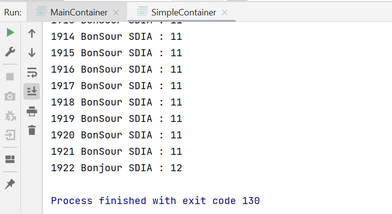

# Genetic algorithm
Genetic algorithms are search and optimization techniques inspired by evolutionary biology. They are often used to solve complex problems in which finding the exact solution using traditional methods is difficult.

Genetic algorithms start by creating a population of potential solutions, often called "individuals". Each individual is then evaluated based on a fitness function, which measures the quality of the solution it represents.

Next, the algorithm uses a combination of selection, reproduction, and mutation to create a new population of individuals that may be better suited to the problem at hand. This process is repeated for a number of generations until a satisfactory solution is found or a stopping criterion is met.

Genetic algorithms are used in a wide range of applications, including engineering design, financial modeling, and artificial intelligence. 

In this TP We will create an application to display 'BONJOUR' by using the genetique algourithme. 

## Sequential method
### Individual class 
This class defines an individual for a genetic algorithm, where each individual is represented by a set of 7 genes (stored in the "genes" array) and a fitness score (stored in "fitness"). The constructor of the class randomly initializes the genes of the individual with lowercase letters from the English alphabet. The "calculateFitness" method calculates the fitness score of the individual by comparing each gene with the corresponding letter in the word "bonjour" and adding 1 to the score for each match. The "compareTo" method implements the Comparable interface to allow comparison and sorting of individuals based on their fitness score.

```
import java.util.Random;

public class Individual implements Comparable{
    //Bonjour
    //chromosome
    private char genes[]=new char[7];
    private int fitness;

    public Individual() {
        Random rnd=new Random();
        for (int i=0;i<genes.length;i++){
            Random rand = new Random();
            char c = (char)(rand.nextInt(26) + 97);
            //System.out.println(c);
            genes[i]= c;
        }
    }
    public void calculateFitness(){
        fitness=0;
        char str[]={'b','o','n','j','o','u','r'};
        int  i=0;
        for (int gene:genes) {
                if(gene==str[i]){
                    fitness=fitness+1;
                }
                i++;
        }
    }

    public int getFitness() {
        return fitness;
    }

    public char[] getGenes() {
        return genes;
    }

    @Override
    public int compareTo(Object o) {
        Individual individual=(Individual) o;
        if (this.fitness>individual.fitness)
            return 1;
        else if(this.fitness<individual.fitness){
            return -1;
        }else
            return 0;
    }
}
```
### Population class 
This class represents a population of individuals in a genetic algorithm. It contains a list of individuals, and provides methods to initialize, calculate the fitness, select individuals based on their fitness, perform crossover and mutation operations, and sort the individuals based on their fitness. The selection method chooses the two fittest individuals from the population. The crossover method performs a crossover operation between the two selected individuals to generate two new individuals. The mutation method mutates the genes of the two new individuals. Finally, the sortPopulation method sorts the individuals in descending order based on their fitness. The getFitnessIndivd method returns the fittest individual in the population.
```
import java.util.*;

public class Population {

    List<Individual> individuals=new ArrayList<>();
    Individual firstFitness;
    Individual secondFitness;
    Random rnd=new Random();
    public void initialaizePopulation(){
        for (int i=0;i<30;i++){
           individuals.add(new Individual());
        }
    }
    public void calculateIndFintess(){
        for (int i=0;i<30;i++){
            individuals.get(i).calculateFitness();
        }

    }
    public void selection(){
        firstFitness=individuals.get(0);
        secondFitness=individuals.get(1);
    }
    //croisement
    public void crossover(){

        int pointCroisment=rnd.nextInt(6);
        pointCroisment++;
        Individual individual1=new Individual();
        Individual individual2=new Individual();
        for (int i=0;i<individual1.getGenes().length;i++) {
            individual1.getGenes()[i]=firstFitness.getGenes()[i];
            individual2.getGenes()[i]=secondFitness.getGenes()[i];
        }
        for (int i=0;i<pointCroisment;i++) {
            individual1.getGenes()[i]=secondFitness.getGenes()[i];
            individual2.getGenes()[i]=firstFitness.getGenes()[i];
        }
        System.out.println(Arrays.toString(individual1.getGenes()));
        System.out.println(Arrays.toString(individual2.getGenes()));

        individuals.set(individuals.size()-2,individual1);
        individuals.set(individuals.size()-1,individual2);
    }
    public void mutation(){
       int index=rnd.nextInt(7);
        Random rand = new Random();
        char c = (char)(rand.nextInt(26) + 97);
       if(individuals.get(individuals.size()-2).getGenes()[index]==c){
           Random rand1 = new Random();
           char c1 = (char)(rand1.nextInt(26) + 97);
           individuals.get(individuals.size()-2).getGenes()[index]=c1;
       }else{
           individuals.get(individuals.size()-2).getGenes()[index]=c;
       }
        index=rnd.nextInt(7);
        Random rand2 = new Random();
        char c2 = (char)(rand2.nextInt(26) + 97);
        if(individuals.get(individuals.size()-1).getGenes()[index]==c2){
            Random rand3 = new Random();
            char c3 = (char)(rand3.nextInt(26) + 97);
            individuals.get(individuals.size()-1).getGenes()[index]=c3;
        }else{
            individuals.get(individuals.size()-1).getGenes()[index]=c2;
        }
    }

    public List<Individual> getIndividuals() {
        return individuals;
    }
    public void sortPopulation(){
        Collections.sort(individuals,Collections.reverseOrder());
    }
    public Individual getFitnessIndivd(){
        return individuals.get(0);
    }
}

```

### Main class 
The AGApp class is a Java program that implements a simple Genetic Algorithm. It initializes a population of 30 individuals, calculates their fitness, and sorts them in descending order based on their fitness values. The algorithm then iterates through a maximum of 1000 generations, selecting two individuals with the highest fitness, performing crossover and mutation, and repeating the fitness calculation and sorting process. The program outputs the chromosome and fitness of the individual with the highest fitness after each iteration until either the maximum number of iterations is reached or an individual with a fitness value of 7 is found.
```
public class AGApp {
    private static final int MAX_IT=1000;
    private static final int MAX_FITNESS=7;
    public static void main(String[] args) {

       Population population=new Population();
       population.initialaizePopulation();
       population.calculateIndFintess();
       population.sortPopulation();
       int it=0;
       System.out.println("Chromosome :"+Arrays.toString(population.getFitnessIndivd().getGenes())+" fitness :"+population.getFitnessIndivd().getFitness());

        while (it<MAX_IT && population.getFitnessIndivd().getFitness()<MAX_FITNESS){
            population.selection();
            population.crossover();
            Random random=new Random();
            if (random.nextInt(101)<50)
                population.mutation();
            population.calculateIndFintess();
            population.sortPopulation();
            System.out.println("Chromosome :"+Arrays.toString(population.getFitnessIndivd().getGenes())+" fitness :"+population.getFitnessIndivd().getFitness());

         it++;
        }

    }
}
```
### Execution


## SMA method
### AgentFitness Class
The AgentFitness class represents an agent with its associated fitness value. This class is designed to store information about an agent's identity (aid) and its fitness level (fitness), allowing for easy retrieval and modification of these properties through getter and setter methods.

Additionally, the class implements the Comparable interface, indicating that instances of AgentFitness can be compared to each other. The compareTo method is overridden to define the comparison logic based on the fitness values of two AgentFitness objects.

By implementing Comparable, you can compare agents based on their fitness values, enabling sorting and ordering operations. When comparing two instances, the compareTo method determines whether one agent's fitness is greater, lesser, or equal to another's, returning a positive integer, negative integer, or zero, respectively.

This class can be useful in scenarios where you need to rank or sort agents based on their fitness levels, such as in evolutionary algorithms, genetic programming, or other optimization techniques.
```
import jade.core.AID;

public class AgentFitness implements Comparable{
    private AID aid;
    private int fitness;

    public AgentFitness(AID aid, int fitness) {
        this.aid = aid;
        this.fitness = fitness;
    }

    public AID getAid() {
        return aid;
    }

    public void setAid(AID aid) {
        this.aid = aid;
    }

    public int getFitness() {
        return fitness;
    }

    public void setFitness(int fitness) {
        this.fitness = fitness;
    }
    @Override
    public int compareTo(Object o) {
        AgentFitness agentFitness=(AgentFitness) o;
        if (this.fitness>agentFitness.fitness)
            return 1;
        else if(this.fitness<agentFitness.fitness){
            return -1;
        }else
            return 0;
    }
}
```
### IndividualAgent class 
the IndividualAgent class extends the Agent class. It is designed to simulate an individual agent in a Genetic Algorithm (GA) system. The agent's genetic makeup is represented by an array of characters called genes, which is randomly initialized upon setup. The agent can receive messages to perform various actions such as mutating its genes, calculating its fitness, exchanging chromosomes, and updating its genes based on received chromosomes. The agent communicates with other agents using the ACLMessage class. The CyclicBehaviour inside the setup() method handles incoming messages and triggers the appropriate actions based on the message content. The agent registers itself with the DFService to provide its services. The mutation() method randomly mutates one of the genes with a given probability. The calculateFitness() method determines the fitness of the individual by comparing its genes to a target solution. The sendChromosome() method sends the individual's chromosome to the message sender, and the changeChromosome() method updates the agent's genes based on the received chromosome. The takeDown() method is responsible for deregistering the agent from the DFService upon termination. Overall, this code represents the behavior and functionality of an individual agent in a GA system.
```
import jade.core.Agent;
import jade.core.behaviours.CyclicBehaviour;
import jade.domain.DFService;
import jade.domain.FIPAAgentManagement.DFAgentDescription;
import jade.domain.FIPAAgentManagement.ServiceDescription;
import jade.domain.FIPAException;
import jade.lang.acl.ACLMessage;

import java.util.Random;

public class IndividualAgent extends Agent {
    private char genes[]=new char[GAUtils.Max_Fitness];
    private int fitness;
    Random rnd=new Random();
    @Override
    protected void setup() {
        DFAgentDescription dfAgentDescription=new DFAgentDescription();
        dfAgentDescription.setName(getAID());
        ServiceDescription serviceDescription=new ServiceDescription();
        serviceDescription.setType("ga");
        serviceDescription.setName("ga_ma");
        dfAgentDescription.addServices(serviceDescription);
        try {
            DFService.register(this,dfAgentDescription);
        } catch (FIPAException e) {
            e.printStackTrace();
        }

        for (int i=0;i<genes.length;i++){
            genes[i]= GAUtils.CHARATERS.charAt(rnd.nextInt(GAUtils.CHARATERS.length()));
        }
        //mutation
       addBehaviour(new CyclicBehaviour() {
           @Override
           public void action() {
               ACLMessage receivedMSG = receive();
               if(receivedMSG!=null){
                       switch (receivedMSG.getContent()){
                           case "mutation":mutation();break;
                           case "fitness" : calculateFintess(receivedMSG);break;
                           case "chromosome":sendChromosome(receivedMSG);break;
                           default: changeChromosome(receivedMSG);break;
                       }


               }else {
                   block();
               }
           }
       });
    }

private void mutation(){
    int index=rnd.nextInt(GAUtils.Max_Fitness);
    if (rnd.nextDouble()<GAUtils.MUTATION_PROB){
        genes[index]=GAUtils.CHARATERS.charAt(rnd.nextInt(GAUtils.CHARATERS.length()));
    }
}

private void calculateFintess(ACLMessage receivedMSG){
    fitness=0;
    for (int i=0;i<GAUtils.Max_Fitness;i++) {
        if(genes[i]==GAUtils.SOLUTION.charAt(i))
            fitness+=1;
    }
    ACLMessage replyMsg=receivedMSG.createReply();
    replyMsg.setContent(String.valueOf(fitness));
    send(replyMsg);
}
private void sendChromosome(ACLMessage receivedMSG){
    ACLMessage replyMsg=receivedMSG.createReply();
    replyMsg.setContent(new String(genes));
    send(replyMsg);
}
private void  changeChromosome(ACLMessage receivedMSG){
    genes=receivedMSG.getContent().toCharArray();
    mutation();
    calculateFintess(receivedMSG);

}

    @Override
    protected void takeDown() {
        try {
            DFService.deregister(this);
        } catch (FIPAException e) {
            e.printStackTrace();
        }
    }
}

```
### MainAgentGA Class 
The MainAgentGA class represents an agent in a Genetic Algorithm (GA) system. The agent's main functionality is to participate in the GA process, including fitness calculation, selection, and crossover.

Upon setup, the agent searches for other agents with the service type "ga" using the DFService class. It initializes a list of AgentFitness objects to store the fitness information of other agents.

The agent then calculates the fitness of its own population by sending a request message to all other agents and waiting for their responses. The fitness values received are stored in the agentsFitness list.

Next, the agent executes a sequential behavior that consists of two sub-behaviors. The first sub-behavior receives fitness messages from other agents, updates the fitness values in the agentsFitness list, and checks if it has received fitness values from all agents.

Once all fitness values are received, the agent proceeds to the second sub-behavior, which performs selection, crossover, and fitness evaluation on the selected individuals. The crossover operation involves exchanging genetic information between two parent individuals to produce offspring individuals.

After each iteration of crossover, the agent sends a request message to the top-ranked individual (based on fitness) to obtain its chromosome and fitness value. The agent prints the iteration number, received chromosome, and the fitness value of the top-ranked individual.

The second sub-behavior continues until a termination condition is met, either reaching the maximum number of iterations or finding a solution with maximum fitness.

Throughout the process, the agent communicates with other agents using ACL messages, sending and receiving chromosome information and fitness values.

Finally, the agent provides helper methods to calculate fitness, set agent fitness values, send messages to specific agents, and display the population's fitness values.

```
import jade.core.AID;
import jade.core.Agent;
import jade.core.behaviours.Behaviour;
import jade.core.behaviours.SequentialBehaviour;
import jade.domain.DFService;
import jade.domain.FIPAAgentManagement.DFAgentDescription;
import jade.domain.FIPAAgentManagement.ServiceDescription;
import jade.domain.FIPAException;
import jade.lang.acl.ACLMessage;

import java.util.ArrayList;
import java.util.Collections;
import java.util.List;
import java.util.Random;

public class MainAgentGA extends Agent {
    List<AgentFitness> agentsFitness=new ArrayList<>();
    Random rnd=new Random();
    @Override
    protected void setup() {
        DFAgentDescription dfAgentDescription=new DFAgentDescription();
        ServiceDescription serviceDescription=new ServiceDescription();
        serviceDescription.setType("ga");
        dfAgentDescription.addServices(serviceDescription);
        try {
            DFAgentDescription[] agentsDescriptions = DFService.search(this, dfAgentDescription);
            System.out.println(agentsDescriptions.length);
            for (DFAgentDescription dfAD:agentsDescriptions) {
                agentsFitness.add(new AgentFitness(dfAD.getName(),0));
            }
        } catch (FIPAException e) {
            e.printStackTrace();
        }
        calculateFintness();
        SequentialBehaviour sequentialBehaviour=new SequentialBehaviour();
        sequentialBehaviour.addSubBehaviour(new Behaviour()
        {
            int cpt=0;
            @Override
            public void action() {
                ACLMessage receivedMSG = receive();
                if (receivedMSG!=null){
                    cpt++;
                    System.out.println(cpt);
                    int fintess=Integer.parseInt(receivedMSG.getContent());
                    AID sender=receivedMSG.getSender();
                    //System.out.println(sender.getName()+" "+fintess);
                    setAgentFintess(sender,fintess);
                    if(cpt==GAUtils.POPULATION_SIZE){
                        Collections.sort(agentsFitness,Collections.reverseOrder());
                        showPopulation();
                    }
                }else {
                    block();
                }
            }

            @Override
            public boolean done() {
                return  cpt==GAUtils.POPULATION_SIZE;
            }

        });
        sequentialBehaviour.addSubBehaviour(new Behaviour() {
            int it=0;
            AgentFitness agent1;
            AgentFitness agent2;
            @Override
            public void action() {
                selection();
                crossover();
                Collections.sort(agentsFitness,Collections.reverseOrder());
                sendMessage(agentsFitness.get(0).getAid(),"chromosome",ACLMessage.REQUEST);
                ACLMessage aclMessage=blockingReceive();
                System.out.println(it+" "+aclMessage.getContent()+" : "+agentsFitness.get(0).getFitness());
                it++;
            }
            private void selection(){
                //System.out.println("***** Selection ****");
                agent1=agentsFitness.get(0);
                agent2=agentsFitness.get(1);
                sendMessage(agent1.getAid(),"chromosome",ACLMessage.REQUEST);
                sendMessage(agent2.getAid(),"chromosome",ACLMessage.REQUEST);
            }
            private void crossover(){
                ACLMessage aclMessage1=blockingReceive();
                ACLMessage aclMessage2=blockingReceive();

                int pointCroisment=rnd.nextInt(GAUtils.Max_Fitness-2);
                //System.out.println(pointCroisment);
                pointCroisment++;
                char []chromosomParent1= aclMessage1.getContent().toCharArray();
                char []chromosomParent2=aclMessage2.getContent().toCharArray();
                char []chromosomOffstring1=new char[GAUtils.Max_Fitness];
                char [] chromosomOffstring2=new char[GAUtils.Max_Fitness];
                for (int i=0;i<chromosomParent1.length;i++) {
                    chromosomOffstring1[i]=chromosomParent1[i];
                    chromosomOffstring2[i]=chromosomParent2[i];
                }
                for (int i=0;i<pointCroisment;i++) {
                    chromosomOffstring1[i]=chromosomParent2[i];
                    chromosomOffstring2[i]=chromosomParent1[i];
                }

                int fitness=0;
                for (int i=0;i<GAUtils.Max_Fitness;i++) {
                    if(chromosomOffstring1[i]==GAUtils.SOLUTION.charAt(i))
                        fitness+=1;
                }
                agentsFitness.get(GAUtils.POPULATION_SIZE-2).setFitness(fitness);

                fitness=0;
                for (int i=0;i<GAUtils.Max_Fitness;i++) {
                    if(chromosomOffstring2[i]==GAUtils.SOLUTION.charAt(i))
                        fitness+=1;
                }
                agentsFitness.get(GAUtils.POPULATION_SIZE-1).setFitness(fitness);


                sendMessage(agentsFitness.get(GAUtils.POPULATION_SIZE-2).getAid(),new String(chromosomOffstring1),ACLMessage.REQUEST);

                sendMessage(agentsFitness.get(GAUtils.POPULATION_SIZE-1).getAid(),new String(chromosomOffstring2),ACLMessage.REQUEST);

                ACLMessage receivedMsg1=blockingReceive();
                ACLMessage receivedMsg2=blockingReceive();
                setAgentFintess(receivedMsg1.getSender(),Integer.parseInt(receivedMsg1.getContent()));
                setAgentFintess(receivedMsg2.getSender(),Integer.parseInt(receivedMsg2.getContent()));

            }
            @Override
            public boolean done() {
                return it==GAUtils.MAX_IT || agentsFitness.get(0).getFitness()==GAUtils.Max_Fitness;
            }
        });
        addBehaviour(sequentialBehaviour);

    }
private void calculateFintness(){
    ACLMessage message=new ACLMessage(ACLMessage.REQUEST);

    for (AgentFitness agf:agentsFitness) {
        message.addReceiver(agf.getAid());
    }
    message.setContent("fitness");
    send(message);

}
private void setAgentFintess(AID aid,int fitness){
        for (int i=0;i<GAUtils.POPULATION_SIZE;i++){
            if(agentsFitness.get(i).getAid().equals(aid)){
                agentsFitness.get(i).setFitness(fitness);
                //System.out.println(fitness+"=:="+agentsFitness.get(i).getFitness());
                break;
            }
        }
}
private void sendMessage(AID aid,String content,int performative){
        ACLMessage message=new ACLMessage(performative);
        message.setContent(content);
        message.addReceiver(aid);
        send(message);

}
private void showPopulation(){
    for (AgentFitness agentFitness:agentsFitness) {
        System.out.println(agentFitness.getAid().getName()+" "+agentFitness.getFitness());
    }
}
}

```

### MainContainer Class
The MainContainer class serves as the entry point for creating and starting the main container in a JADE (Java Agent Development Framework) platform.

In the main() method, the code initializes a JADE runtime environment by creating an instance of the Runtime class using Runtime.instance(). It also creates a ProfileImpl instance to specify the profile settings for the agent platform. In this case, the code sets the GUI parameter to "true", enabling the graphical user interface (GUI) for the JADE platform.

Next, the code creates the main container using the createMainContainer() method of the Runtime instance, passing the ProfileImpl instance as an argument. This main container is the central component of the JADE platform, responsible for managing the lifecycle of agents.

Finally, the start() method is called on the AgentContainer instance to start the main container and initialize the agent platform.

By executing this code, the JADE platform is initialized with the specified profile settings and the main container is started, enabling the development and execution of agents within the platform.
```
import jade.core.Profile;
import jade.core.ProfileImpl;
import jade.core.Runtime;
import jade.wrapper.AgentContainer;
import jade.wrapper.ControllerException;

public class MainContainer {
    public static void main(String[] args) throws ControllerException {
        Runtime runtime=Runtime.instance();
        ProfileImpl profile=new ProfileImpl();
        profile.setParameter(Profile.GUI,"true");
        AgentContainer mainContainer = runtime.createMainContainer(profile);
        mainContainer.start();
    }
}
```
### SimpleContainer class 
The SimpleContainer class serves as the entry point for creating and starting the agent container in a JADE (Java Agent Development Framework) platform.

In the main() method, the code initializes a JADE runtime environment by creating an instance of the Runtime class using Runtime.instance(). It also creates a ProfileImpl instance to specify the profile settings for the agent platform. In this case, the code sets the MAIN_HOST parameter to "localhost", indicating that the main container will be created on the local machine.

Next, the code creates the agent container using the createAgentContainer() method of the Runtime instance, passing the ProfileImpl instance as an argument. The agent container is responsible for managing the creation, execution, and communication of agents.

The code then creates and starts multiple instances of IndividualAgent by iterating over a loop. Each IndividualAgent is assigned a unique name based on the loop index and is created within the agent container.

Finally, the code creates and starts an instance of MainAgentGA, which represents the main agent responsible for coordinating the Genetic Algorithm (GA) process. This agent is also created within the agent container.

By executing this code, the agent container is created, and the specified agents (IndividualAgent and MainAgentGA) are instantiated and started within the container, enabling the execution of the agent-based system in the JADE platform.
```
import jade.core.Profile;
import jade.core.ProfileImpl;
import jade.core.Runtime;
import jade.wrapper.AgentContainer;
import jade.wrapper.AgentController;
import jade.wrapper.StaleProxyException;

public class SimpleContainer {
    public static void main(String[] args) throws StaleProxyException {
        Runtime runtime=Runtime.instance();
        ProfileImpl profile=new ProfileImpl();
        profile.setParameter(Profile.MAIN_HOST,"localhost");
        AgentContainer agentContainer = runtime.createAgentContainer(profile);
        AgentController mainAgent=null;
        for (int i=0;i< GAUtils.POPULATION_SIZE;i++){
            mainAgent = agentContainer.createNewAgent(String.valueOf(i), IndividualAgent.class.getName(), new Object[]{});
            mainAgent.start();
        }
         mainAgent = agentContainer.createNewAgent("mainAgent", MainAgentGA.class.getName(), new Object[]{});
        mainAgent.start();


    }
}

```
### Execution 



